# HarmWord 鸿蒙前端

基于 HarmonyOS NEXT (API 18) 的背单词 App 前端，使用 ArkTS + ArkUI。

## 运行方式

1. DevEco Studio 打开本项目
2. 确保后端已启动 (`cd D:\backend && npm start`)
3. 连接模拟器或真机，点击 Run

## 目录结构

```
entry/src/main/ets/
├── entryability/
│   └── EntryAbility.ets       # Ability 入口，初始化 StorageUtil
├── models/
│   └── Models.ets             # 数据类型定义 (WordItem, WordBook, SearchWordItem 等)
├── utils/
│   ├── Constants.ets          # BASE_URL = http://10.0.2.2:3000
│   ├── HttpUtil.ets           # 网络请求 (GET/POST/PUT/DELETE + JWT)
│   ├── StorageUtil.ets        # Preferences 本地存储
│   └── AudioUtil.ets          # AVPlayer 单词发音
└── pages/
    ├── Index.ets              # TabBar 容器 (首页/错词本/统计/我的) + 顶部搜索入口
    ├── LoginPage.ets          # 登录 + 注册
    ├── HomePage.ets           # 今日任务 + ActionSheet 选择学习模式
    ├── StudyPage.ets          # 学习页 (卡片/听写/拼写 三种模式)
    ├── SearchPage.ets         # 全局单词搜索 (Search 组件+详情 Panel+收藏)
    ├── FavoritesPage.ets      # 收藏夹 + 错词本 (Tab 切换)
    ├── StatsPage.ets          # 学习统计
    ├── CalendarPage.ets       # 打卡热力图日历
    ├── BookSelectPage.ets     # 词书选择
    └── MinePage.ets           # 个人中心 + 单词搜索入口 + 退出登录
```

## 页面导航

```
App 启动 → Index (检查登录)
  ├── 未登录 → LoginPage → 登录成功 → Index
  └── 已登录 → TabBar
       ├── 顶部 AppBar 🔍 → SearchPage
       ├── 首页 (HomePage) → 开始学习 → 选择模式 (卡片/听写/拼写) → StudyPage → 返回
       ├── 错词本 (FavoritesPage) → 学习错词 → StudyPage
       ├── 统计 (StatsPage) → 学习日历 → CalendarPage
       └── 我的 (MinePage) → 单词搜索 → SearchPage
                           → 词书选择 → BookSelectPage
```

## 网络配置

- 模拟器中 `10.0.2.2` 映射宿主机 `localhost`
- `module.json5` 已声明 `ohos.permission.INTERNET`

## 开发注意事项

- 新页面必须在 `main_pages.json` 中注册
- Tab 内嵌组件用 `export struct` + `@Component`
- 独立路由页面用 `@Entry` + `@Component`
- HttpUtil.request 的 method 必须用 `http.RequestMethod` 枚举
- ArkTS linter 要求接口传参时可能需用 `class` 替代 `interface`


效果展示：
注册：
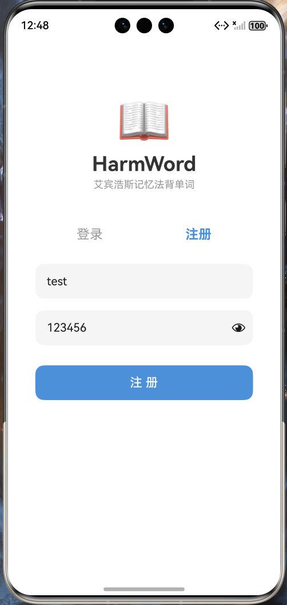

首页：
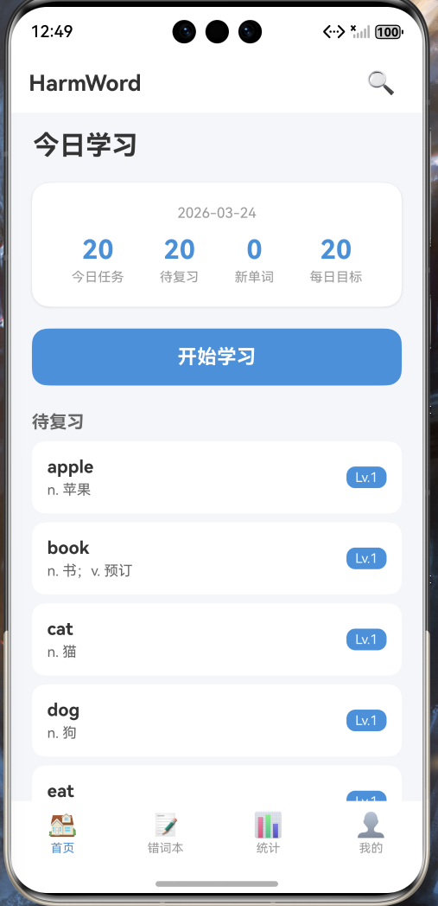

选择学习模式：
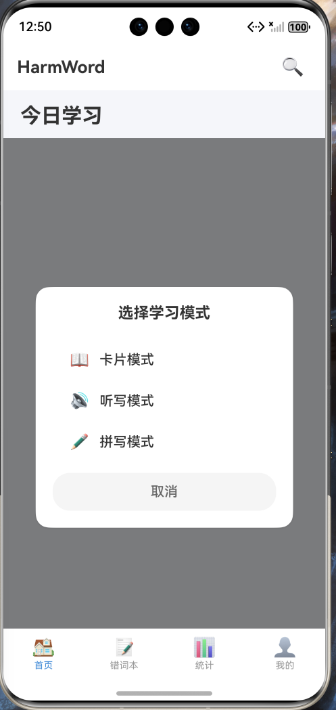

卡片模式：
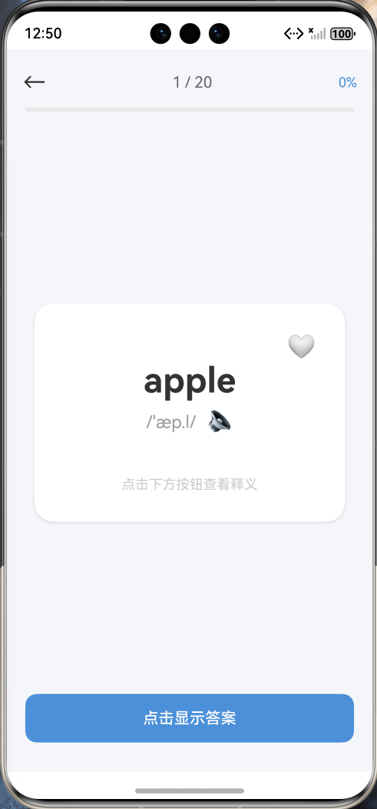

收藏：
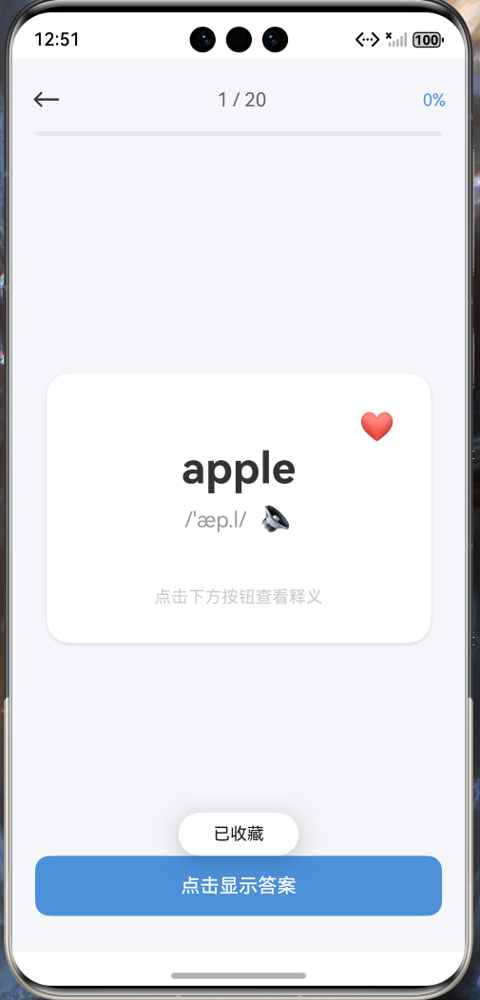

显示答案：
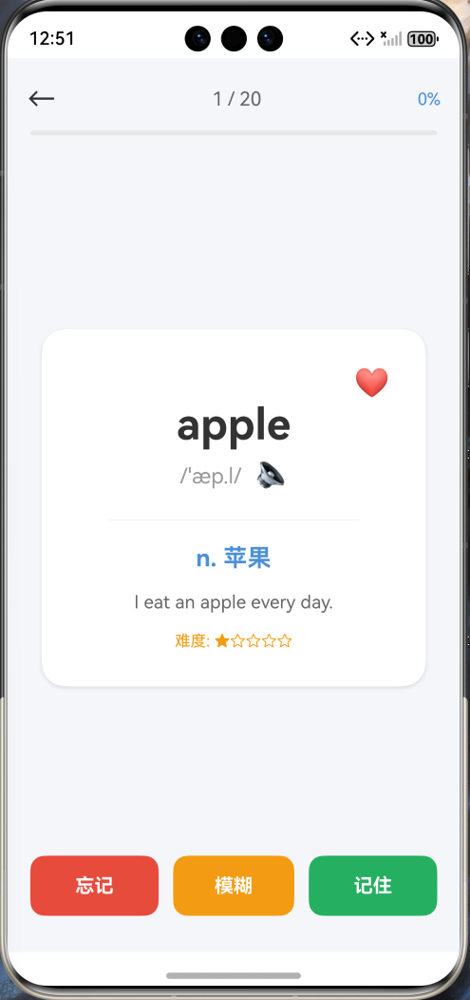

切换到听写模式：
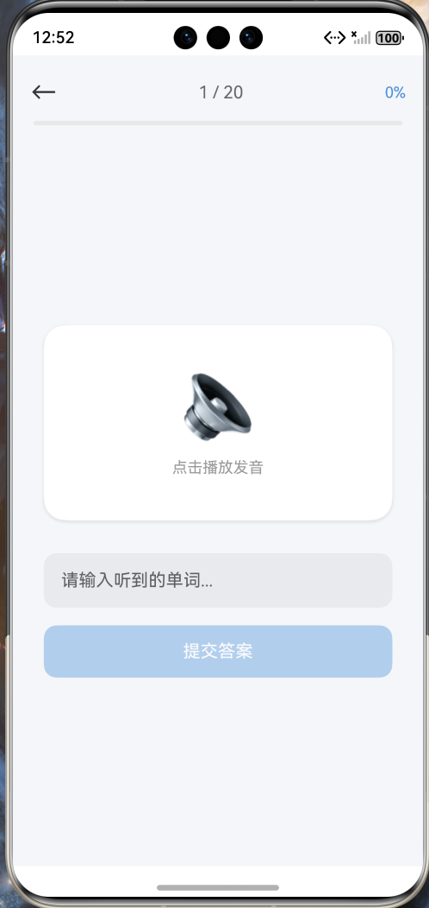

提交答案：
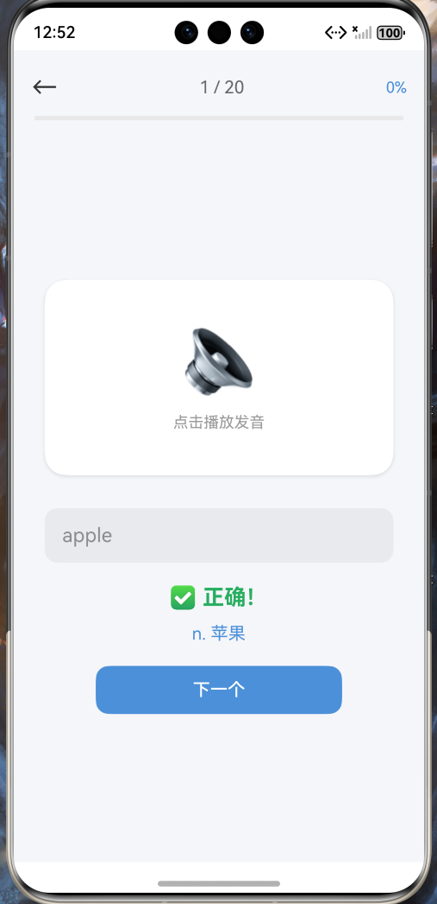

切换拼写模式：
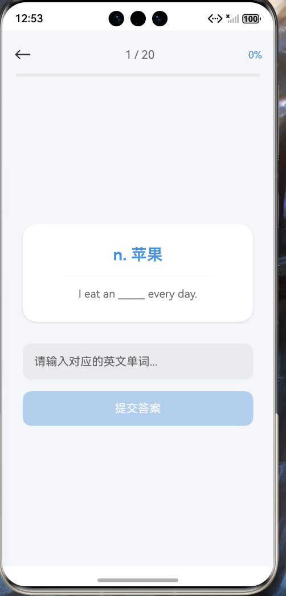

提交答案：
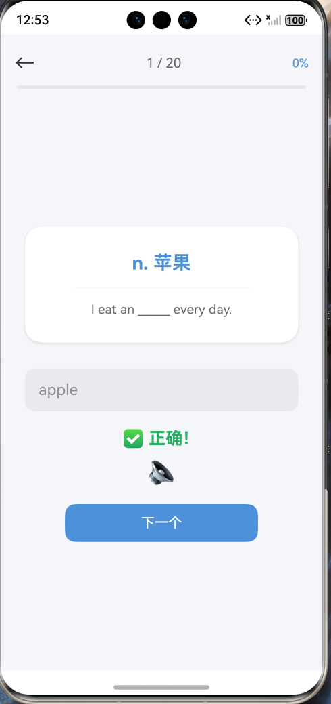

错词本页面收藏夹：
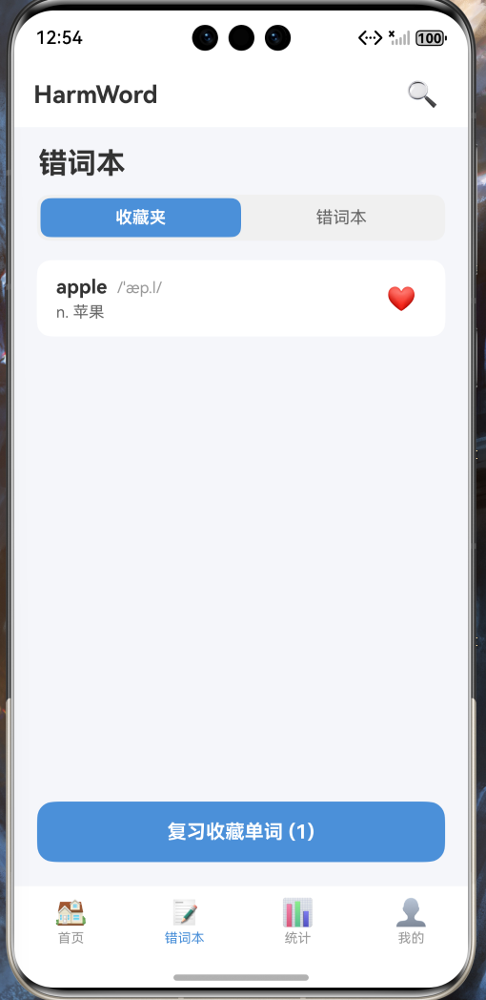

错词本：
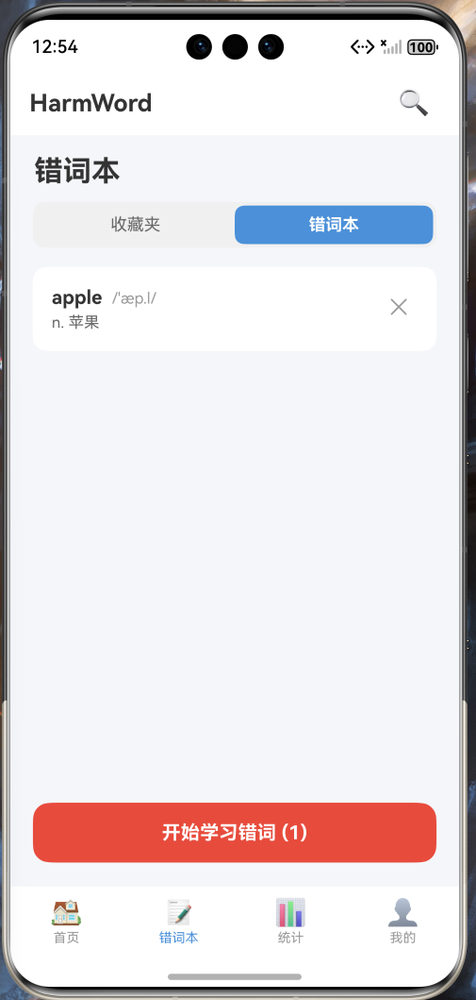

统计页面：
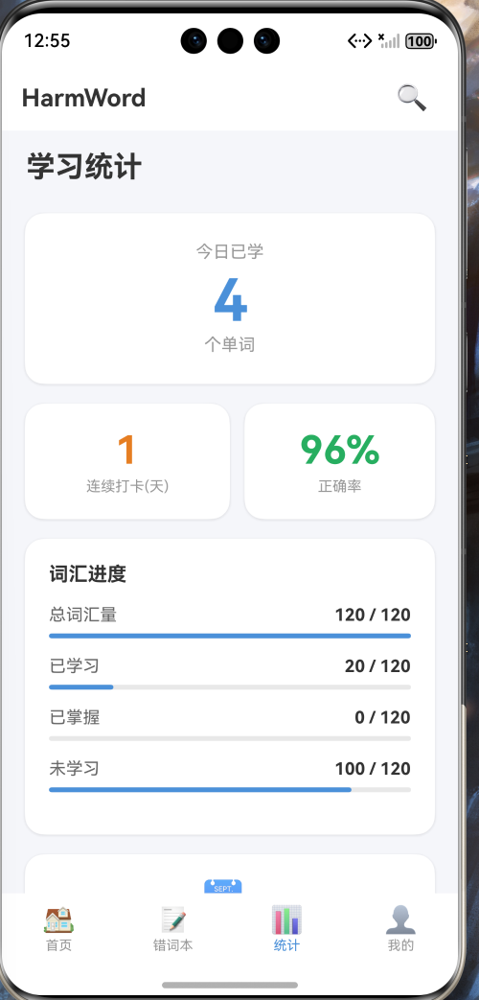

学习日历：
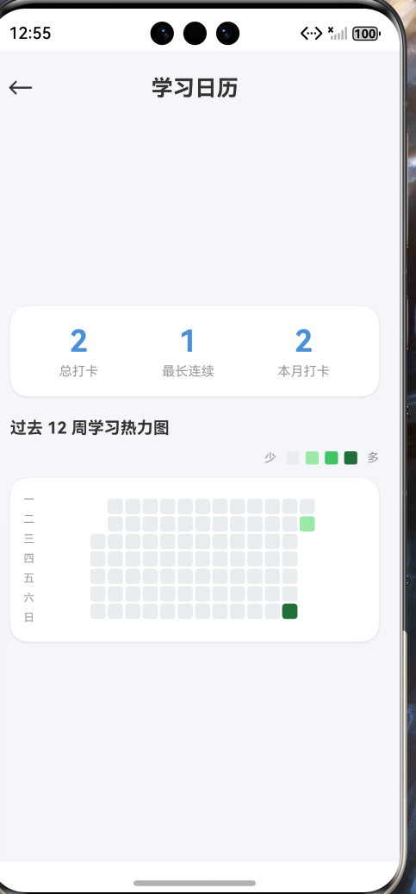

个人主页：
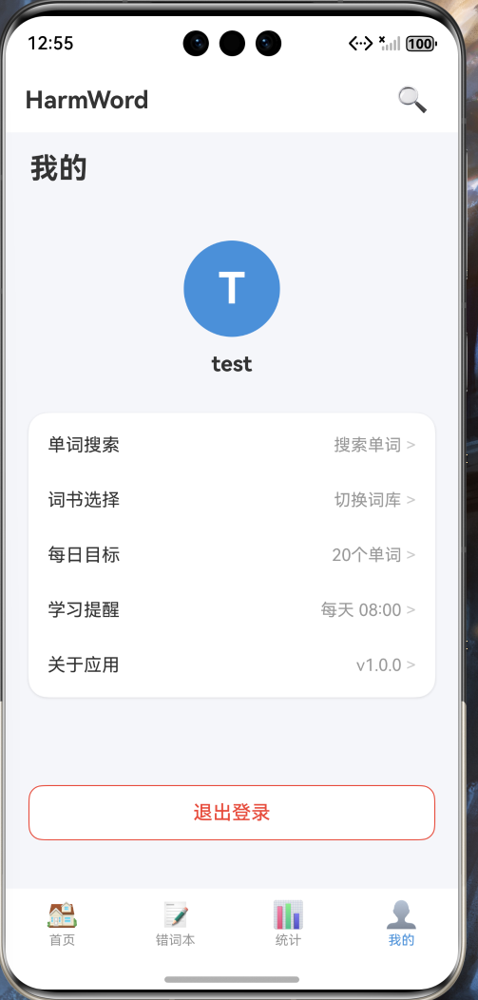

单词搜索：
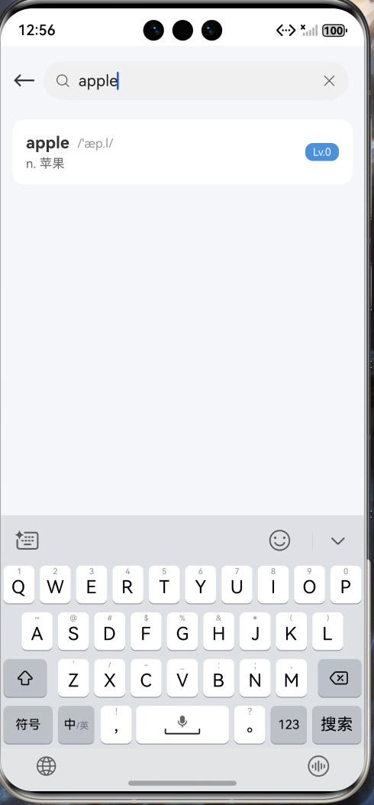
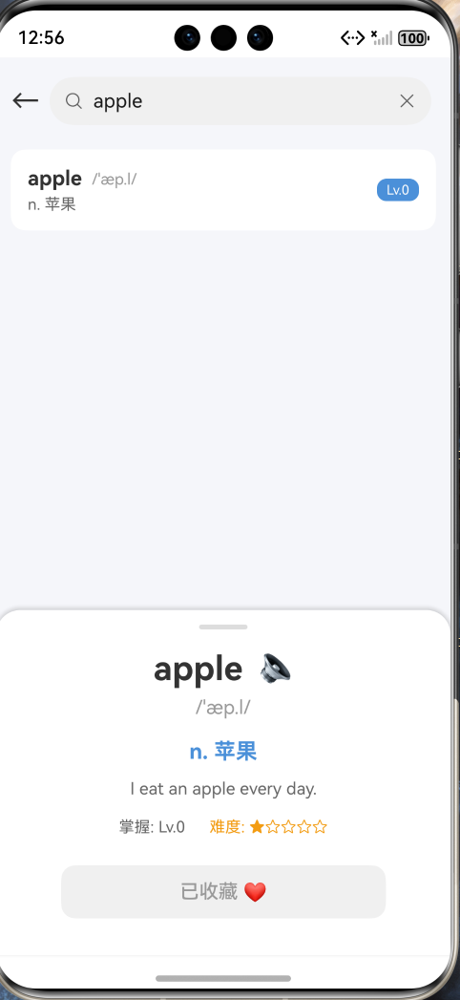

词书选择：
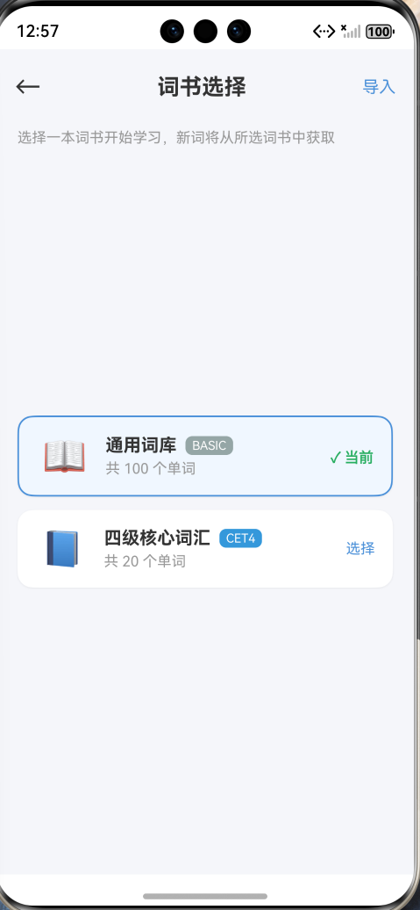